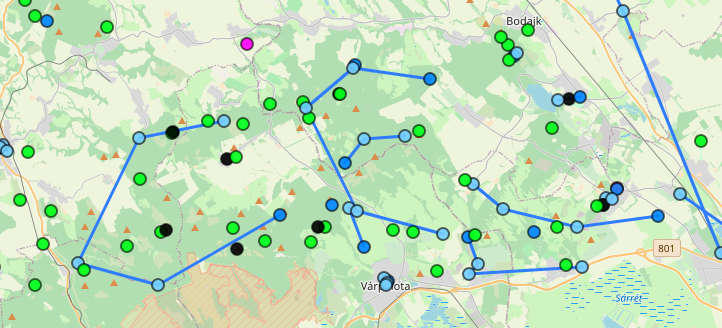

# 🇺🇸 geomap-add-lines

## Intro 

[geocaching.hu](https://geocaching.hu) is the Hungarian geocaching website with a different (albeit overlapping) set of geocaches than [geocaching.com](https://geocaching.com). 

Their [GeoMap interface](https://geocaching.hu/geomap/) is a handy tool to get a quick map-based overview of geocaches hosted on the website. Some geocaches have multiple points that the player has to visit; these are called multi-caches. It would be handy to see which points belong to one multi-cache, but this functionality is not available on GeoMap.

This is exactly what this bookmarklet does: it connects the points of a multi-cache with a line in the order they are listed on the website.

*Result of using the bookmarklet: blue lines connect the points of multi-caches*

## Usage

1. Save the following address to your bookmarks bar: `javascript:(function (){document.getElementsByTagName('head')[0].appendChild(document.createElement('script')).src='https://cdn.jsdelivr.net/gh/andrashann/geomap-add-lines@main/bookmarklet.min.js';}());`
1. Go to [GeoMap](https://geocaching.hu/geomap/), wait for everything to load, then click the bookmarklet.
1. The connecting lines should appear.

# 🇭🇺 geomap-add-lines

## Bevezető 

A [GeoMap](https://geocaching.hu/geomap/) a [geocaching.hu](https://geocaching.hu) térképes felülete. Egyes geoládák több felkeresendő pontból állnak, ezeket multiládának hívják. Praktikus lenne a térképről látni, hogy mely pontok tartoznak egy multiládához, de ez a funkció hiányzik a GeoMapről.

Pontosan ezt teszi lehetővé ez a bookmarklet: a honlapon megadott sorrendben összköti a multiládák pontjait.

*A bookmarklet használatának eredménye: kék vonal köti össze az egy multiládához tartozó pontokat.*

## Használat

1. Mentsd el az alábbi hivatkozást a könyvjelzőid közé: `javascript:(function (){document.getElementsByTagName('head')[0].appendChild(document.createElement('script')).src='https://cdn.jsdelivr.net/gh/andrashann/geomap-add-lines@main/bookmarklet.min.js';}());`
1. Menj a [GeoMapre](https://geocaching.hu/geomap/) és bökj az új könyvjelzőre (bookmarkletre)!
1. Megjelennek az összekötő vonalak.